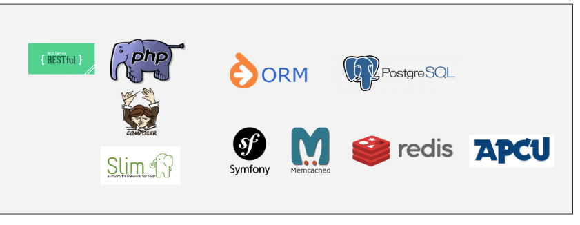
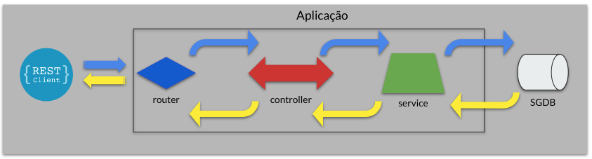

# API de cadastro de Pets e seus Propietários

## Descrição

Trata-se de uma API RestFull para cadastro de pets e seus respectivos proprietários.

## Composição

### Linguagem e Banco de Dados

- PHP 8.1
  - apcu
  - json
  - mbstring
  - memcached
  - pdo
  - pdo_pgsql
  - xml
  - redis
  - yaml
  - zip
- Composer 2
- PostgreSQL 13 (podem ser utilizados outros bancos de dados compatíveis com o Doctrine ORM)

### App

Responsável pela camada da aplicação (controllers, rotas, etc). Composta pelas seguintes dependências:

- Slim Framework 4
    - psr7 1.6
    - slim 4.11
- Symfony yaml 6.1
- Pimple 3.5

### Domain

Pacote responsável pela regra de negócio da aplicação. Composta pelas seguintes dependências:

- Doctrine ORM 2.13
- Doctrine DBAL 3.5
- Symfony Cache 6.1

## Tecnologias

## Arquitetura

## Postman Collection

[Download Collection](./assets/Treinamento%20docker.postman_collection.json)